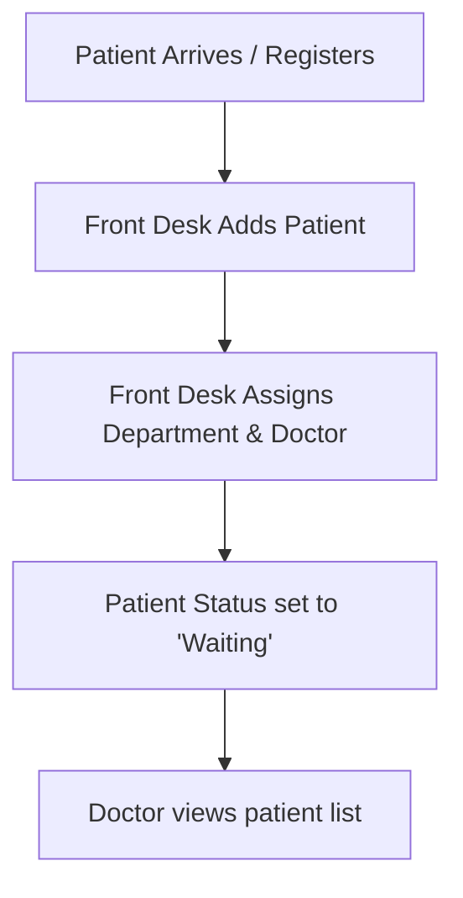
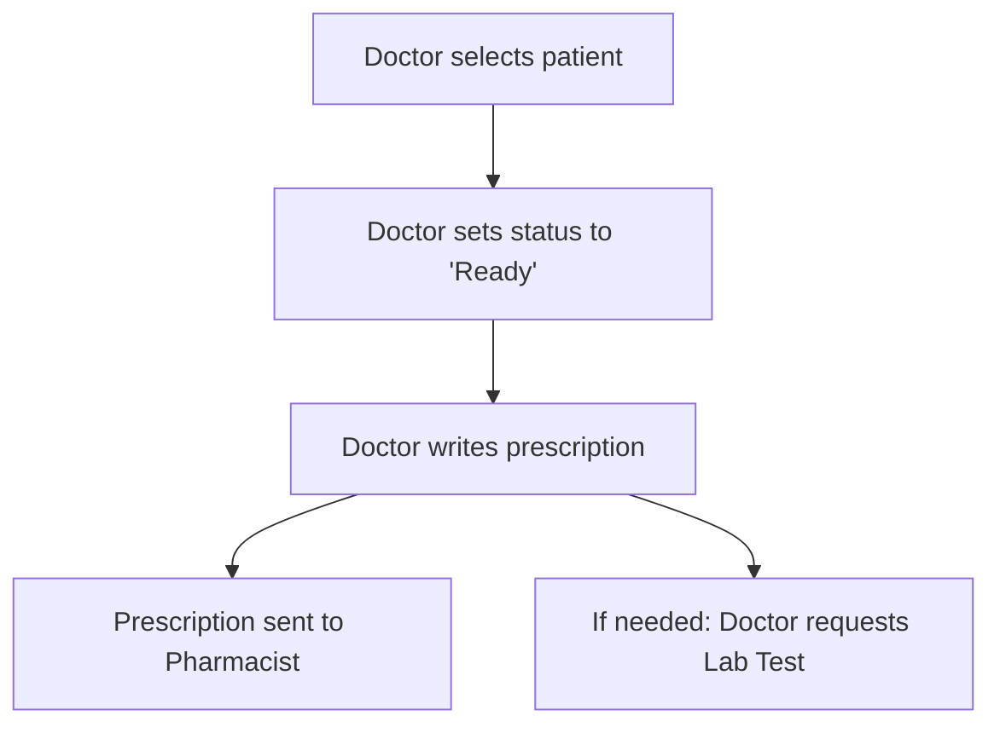
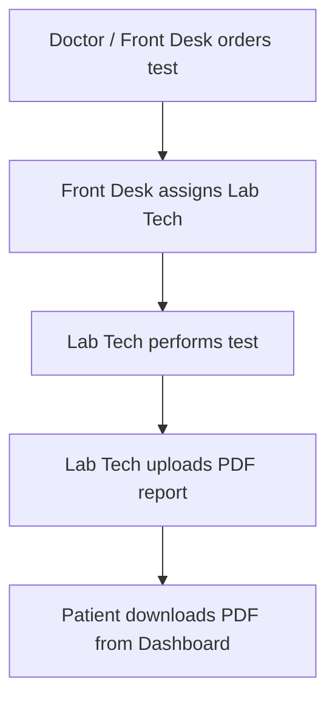

# Sync-Care: Modern Hospital Management System

Sync-Care is a full-stack, role-based Hospital Management System (HMS) designed to streamline healthcare workflows. It connects patients, doctors, front desk staff, lab technicians, pharmacists, and administrators under a single unified platform. 

---

## Project Architecture

Sync-Care is built using a modern decoupled architecture:

* **Frontend**: React.js + Vite (configured with Tailwind CSS / custom vanilla CSS, React Router DOM, and Framer Motion for animations).
* **Backend**: Node.js + Express.js REST API.
* **Database**: MySQL (using stored procedures, relationships, and queries optimized for concurrency).
* **Authentication**: JSON Web Token (JWT) with role-based middleware guards.

---

## Screenshots & Interface Previews

> [!TIP]
> Add your screenshots here.

### 1. Landing Page / Login Selection


### 2. Admin Dashboard


### 3. Doctor Dashboard & Consultations


### 4. Lab Technician Results Console


### 5. Pharmacist Inventory Panel


---

## Demo Login Credentials

For testing and review, use these pre-seeded demo accounts (passwords are identical to their respective IDs):

| Role | Username / ID | Password | Access Capabilities |
| :--- | :--- | :--- | :--- |
| **Administrator** | `admin` | `admin123` | Add/remove doctors, pharmacists, lab techs, and front desk staff. |
| **Doctor** | `dummy_doc` | `dummy_doc` | View assigned patients, prescribe medicines, check diagnosis statuses. |
| **Lab Technician** | `dummy_lab` | `dummy_lab` | Process tests, upload PDF result files, modify statuses. |
| **Pharmacist** | `dummy_med` | `dummy_med` | Manage stock, track low inventory, update price/availability. |
| **Front Desk** | `dummy_front` | `dummy_front` | Register patients, assign doctors/departments, schedule lab tests. |
| **Patient / User** | *(Register via UI)* | *(Custom)* | Check prescriptions, download PDF lab results, view status. |

---

## Core Workflows (User Journeys)

Here is how the distinct modules interact dynamically:

### 1. Patient Admission Workflow


1. **Registration**: A new patient registers via the Patient Login screen using their **Aadhar Card Number**.
2. **Admission**: Alternatively, the **Front Desk** adds a patient to the system using [Add_Patient.jsx](file:///c:/Users/nehra/OneDrive/Desktop/Sync-Care/Hospital_Management_system%20%282%29/Hospital_Management_system/src/pages/Add_Patient.jsx) and assigns a doctor/specialization.
3. **Queue**: The patient's status is initialized to `Waiting`, making them appear in their assigned Doctor's active patient list.

---

### 2. Doctor Consultation & Prescription Workflow


1. **Selection**: The **Doctor** signs in, views their active patient queue, and selects a patient.
2. **Diagnosis**: The Doctor updates the patient's status to `Ready` while consulting.
3. **Treatment**: The Doctor enters prescription details (morning/noon/evening/night dosages) which write directly to the database.
4. **Diagnostics**: If laboratory verification is required, the Doctor requests a specific lab test.

---

### 3. Lab Test & Result Upload Workflow


1. **Ordering**: The **Doctor** or **Front Desk** adds a lab test command detailing the test type and sub-type.
2. **Assignment**: The **Front Desk** assigns an active Lab Technician to the patient's test.
3. **Upload**: The assigned **Lab Technician** logs in, views their assigned cases, and uploads a PDF report. The binary file is saved as a `LONGBLOB` in MySQL.
4. **Retrieval**: The patient logs in to their profile and downloads the PDF report directly.

---

### 4. Pharmacy & Stock Management Workflow
1. **Dispensing**: The **Pharmacist** accesses the prescription database to dispense medications to patients.
2. **Inventory**: The Pharmacist monitors the inventory using the Pharmacy dashboard, which flags low-stock items (`stock <= 5`).
3. **Refills**: The Pharmacist can update pricing, add new medicines, and adjust stock counts.

---

### 5. Admin Staff Management Workflow
1. **Creation**: The **Admin** logs in with `admin` credentials to access the management panel.
2. **Stored Procedures**: When the Admin adds staff (e.g. a Doctor), the backend executes a stored procedure (`CALL AddDoctor(ID, Name, Spec, Password)`) to insert details in the specific staff table and create their auth credentials in the `users` table transactionally.
3. **Removal**: When deleting staff, the admin uses deletion scripts which trigger cascades or cleanups across the backend.

---

## How to Run Locally

### Prerequisites
* **Node.js** (v16.x or higher recommended)
* **MySQL Server** (Running locally on port 3306)

### 1. Database & Backend Setup
1. Open the [HMS-backend](file:///c:/Users/nehra/OneDrive/Desktop/Sync-Care/HMS-backend) directory:
   ```bash
   cd HMS-backend
   ```
2. Install dependencies:
   ```bash
   npm install
   ```
3. Set up your environment variables by copying `.env.example` into a new `.env` file:
   ```env
   PORT=5000
   DB_HOST=127.0.0.1
   DB_PORT=3306
   DB_USER=root
   DB_PASSWORD=your_mysql_password
   DB_NAME=sync_care
   JWT_SECRET=your_jwt_secret_key
   ```
4. Initialize the database schema and seed the admin user:
   ```bash
   node init-db.js
   ```
5. Start the backend server in development mode:
   ```bash
   npm run dev
   ```

### 2. Frontend Setup
1. Navigate to the frontend directory:
   ```bash
   cd "Hospital_Management_system (2)/Hospital_Management_system"
   ```
2. Install dependencies:
   ```bash
   npm install
   ```
3. Run the Vite development server:
   ```bash
   npm run dev
   ```
4. Open your browser and navigate to `http://localhost:5173`.

---

## Cloud Deployment Instructions

### Deploying the Backend on Render
1. Set up a **MySQL database** (on Render or Railway) and copy its connection URL.
2. Create a new **Web Service** on Render connected to this repository.
3. Configure the settings:
   * **Root Directory**: `HMS-backend`
   * **Build Command**: `npm install`
   * **Start Command**: `npm start`
4. Add the following **Environment Variables**:
   * `DATABASE_URL` = `<your-mysql-connection-url>`
   * `JWT_SECRET` = `<your-jwt-secret-key>`
   * `PORT` = `5000` (Render will override this dynamically)

### Connecting the Frontend
The frontend ([main.jsx](file:///c:/Users/nehra/OneDrive/Desktop/Sync-Care/Hospital_Management_system%20%282%29/Hospital_Management_system/src/main.jsx)) automatically detects production environments and redirects requests to the production API. If you deploy a new backend, simply update the fallback URL in `main.jsx`.
